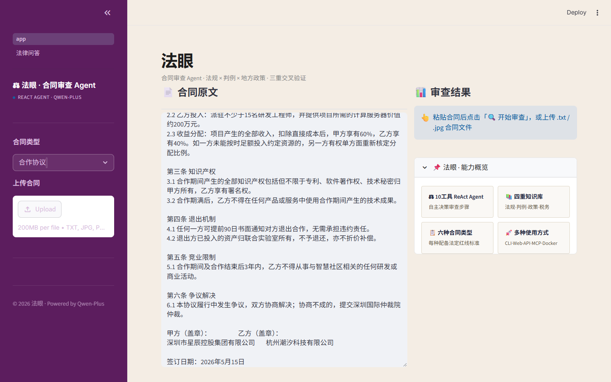
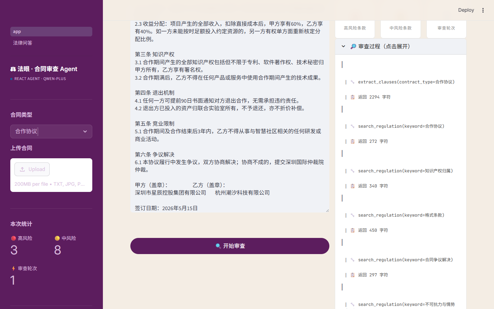

# 从零到一：我用 ReAct Agent 做了一个合同审查工具，踩了 5 个深坑

> 一个 AI 应用项目工程师的实战复盘：6 种合同类型、10 个工具、4 重知识库，以及那些让我怀疑人生的 JSON 格式错误。

---

## 缘起

去年我在审查一份房屋租赁合同时差点踩坑——合同里写"承租方提前退租的，已付押金不予退还，并须另行支付两个月租金作为违约金"。《民法典》第585条明确规定违约金过高的可以请求法院减少，但这份合同把"押金不退"和"额外违约金"拆成了两项，叠加之后远超法定上限。如果当时没注意到，签完就是实打实的损失。

这件事让我开始思考：**能不能让 AI 来做合同审查？**

不是那种简单的"AI 帮你读合同"——是真正能查法规、找判例、看地方政策、算税务影响的专业审查。于是就有了"法眼"这个项目。


> 打开 `streamlit run app.py`，粘贴一份合同（如 `sample_cooperation.txt`），截取两栏布局全貌——左侧合同原文、右侧审查结果。展示深蓝+香槟金的 Legal Editorial 风格。

---

## 一、架构演进：从固定流水线到 ReAct Agent

### 1.0 原型：三步流水线

最开始的架构很简单——把合同审查拆成三个固定步骤：

```
合同全文 → 提取条款 → 风险分析 → 生成报告
```

每个步骤调一次 LLM，输出直接喂给下一步。这个版本能用，但有个致命缺陷：**一旦某一步出错，整个流程崩掉**。比如提取条款漏了一条关键条款，后面的分析就永远覆盖不到。

### 2.0 重构：ReAct Agent

受 Anthropic 和 OpenAI 的 Agent 模式启发，我重构成了 **ReAct（Reasoning + Acting）循环**：

```
第1轮: 思考 → 调用 extract_clauses → 观察结果
第2轮: 思考 → 调用 search_regulation("押金") → 观察结果
第3轮: 思考 → 调用 analyze_single_clause → 观察结果
...
第N轮: 思考 → 调用 generate_final_report → 输出报告
```

AI 自主决定每一步调用哪个工具、传什么参数、什么时候出报告。上限 20 轮，实际通常 12-15 轮就能完成一次完整审查。

**核心工具集（10个）：**

| 工具 | 做什么 |
|------|--------|
| extract_clauses | 从合同全文提取结构化条款 |
| search_regulation | 检索内置法规库 |
| search_case_law | 查找类似判例 |
| check_local_policy | 查地方政策（5个城市） |
| lookup_tax_rule | 查税务规则 |
| web_search | 联网搜索最新法规 |
| analyze_single_clause | 逐条三维评分分析 |
| check_completeness | 检查合同缺了什么 |
| switch_perspective | 切换到对方视角 |
| generate_final_report | 生成五段式审查报告 |


> 展开右侧的"审查过程"折叠面板，截取时间线——能看到每一轮的 🔧 工具调用（extract_clauses → search_regulation → analyze_single_clause...）和 📋 返回字符数。这是展示 ReAct Agent 工作流最直观的方式。

---

## 二、知识库：不只是"查法规"

很多合同审查工具只做一件事——把合同扔给 GPT，问它"有什么风险"。问题是：

1. **LLM 会编造法条**（幻觉）
2. **LLM 不知道最新司法解释**（知识截止日期）
3. **LLM 不熟悉地方政策差异**

法眼的解法是**四重知识体系内置化**——让 Agent 在分析前必须先查资料：

```
法规原文：民法典 + 劳动合同法 + 司法解释 + 行政法规（如《住房租赁条例》）
法院判例：押金纠纷 / 过高违约金 / 试用期违法 / 竞业限制补偿 / 砍头息...
地方政策：北京 / 上海 / 深圳 / 广州 / 成都（备案要求、押金监管、税率差异）
税务规则：增值税 / 个税 / 印花税 / 租金专票 / 技术合同免税...
```

Agent 分析条款时的逻辑是：**"先查法规 → 对比判例 → 参考地方政策 → 算税务影响 → 再下结论"**。这比裸调 LLM 靠谱太多了。

---

## 三、踩坑实录：5 个让我怀疑人生的 Bug

### 坑 1：qwen-plus 的 JSON 地狱

**现象**：模型返回 `400 InternalError.Algo.InvalidParameter`。

**根因**：qwen-plus 在 Function Calling 的 `arguments` 字段里生成非法 JSON——单引号代替双引号、中文引号未转义、尾部多余逗号。DashScope 服务端直接拒绝，连错误都没传到我的代码里。

**尝试过的解法**（共 8 轮迭代）：
1. ❌ 修复重试逻辑 → 重试照样失败
2. ❌ 客户端 JSON 修复 → 修不了（请求被服务端拦截）
3. ❌ 精简系统提示词 → 有改善但不稳定
4. ❌ 纯文本兜底 → 报告质量缩水严重
5. ✅ **最终方案**：文本格式工具调用（`<<TOOL:name>> <<ARGS:json>>`）绕过 DashScope 校验 + 会话存储规避大段 JSON 传参

> 📸 **截图3：模型对比测试（可选）**
> 如果你有之前测试 deepseek / qwen-max 时的终端输出截图，放一张模型对比表或错误日志截图，增强说服力。没有的话可跳过。

### 坑 2：DeepSeek 的 Markdown 执念

切到 deepseek-v3.2 试了试——JSON 格式完美，但报告**永远输出 Markdown**（`# ## ** |`）。报告模板明确要求纯文本格式（因为很多法务系统不支持 Markdown），改了 3 版提示词都拦不住，最后切回 qwen-plus。

教训：**选模型不是只看能力参数，要看它在你的具体任务上的"听话程度"。**

### 坑 3：模型输出"铁律"污染报告

我在报告模板底部加了一行内部约束（"禁止 Markdown、禁止表格..."），结果模型把它逐字输出到了用户报告里。解决方案：把铁律移到 System Prompt，报告模板里只留结构性模板。

### 坑 4：报告被模型"总结"覆盖

Agent 调用 `generate_final_report` 产生了一份完整的五段式报告，但模型在下一轮的文本回复里又自己"总结"了一遍，导致最终输出是总结版而非完整报告。

修复：`last_report` 无条件优先返回——只要 `generate_final_report` 执行过，最终输出一定是工具结果而不是模型回复。

### 坑 5：8 种合同类型扩展的失败

一度把合同类型从 5 种扩展到 13 种，结果 qwen-plus 的 JSON 错误暴增。原因：系统提示词越长，模型越容易在 JSON 格式上出错。最终回退到 6 种（加回借款合同），每种的法条红线反而写得更细更准。

**教训：少即是多——与其覆盖 13 种合同但每种审查粗糙，不如精选 6 种高频类型做到极致。**

---

## 四、报告质量：那些看不见的打磨

生成报告看似简单，实际上花了很多功夫：

- **去重逻辑**：同一条款如果同时触犯多个风险点，只在最高风险段列出，其余段不列也不写"此处同上"
- **评分自洽**：综合风险评分必须与高/中风险条数成比例，不能出现"高风险多但评分低"的矛盾
- **格式强约束**：五段式纯文本模板，禁止表格、禁止 Markdown、禁止免责声明（因为我们提供的分析就是免责分析）
- **条款拆分**：同一编号条款如果有多个独立风险点（如"扣除直接成本后分成，且可单方调整比例"），必须拆成多次独立分析


> 用 `sample_cooperation.txt` + "合作协议" 跑一次完整审查，截取右侧报告卡片全貌。重点展示：顶部三列统计卡片（🔴高风险 🟡中风险 ⚡轮次）+ 五段式报告内容。这是文章最重要的截图。

---

## 五、技术栈

```
模型层：阿里云百炼 qwen-plus (OpenAI 兼容 API)
OCR：qwen-vl-plus（合同照片→文字）
Agent 层：ReAct 循环（20轮上限）+ 10个工具
Web 层：Streamlit（Legal Editorial 设计风格）
兜底：JSON 修复 + 纯文本工具调用 + 会话存储
部署：GitHub + Streamlit Cloud
```


> 截取左侧侧边栏——展示合同类型下拉（6种+自定义）、上传按钮、"本次统计"指标（高/中风险数+轮次）、历史报告下载列表。

---

## 六、下一步

这个项目的 Github 已经开源：[github.com/pppppgy/fayan-contract-review](https://github.com/pppppgy/fayan-contract-review)

接下来计划做三件事：

1. **FastAPI + Docker 云端部署**：把 Streamlit 改成 API 服务，部署到阿里云
2. **RAG 全链路**：把内置知识库迁移到向量数据库（Milvus），支持海量法规实时检索
3. **MCP 协议标准化**：把法眼的 10 个工具用 MCP 协议封装，让其他 Agent 也能调用

---

> 如果你也在做 AI 应用开发，或者踩过类似的坑，欢迎在评论区交流。项目的 Github 仓库在 [这里](https://github.com/pppppgy/fayan-contract-review)，Star 是对我最好的鼓励 ⭐

---

## 📸 截图清单（已完成 4/5 张）

| # | 内容 | 文件 | 状态 |
|---|------|------|------|
| 1 | **主界面全景** | `screenshots/01-main-page.png` | ✅ |
| 2 | **Agent 审查时间线** | `screenshots/02-timeline.png` | ✅ |
| 3 | **模型对比（可选）** | — | ⬜ 跳过 |
| 4 | **审查报告卡片** | `screenshots/04-report-card.png` | ✅ |
| 5 | **侧边栏特写** | `screenshots/05-sidebar.png` | ✅ |

自动化截图方式：Playwright CLI 全自动操作浏览器完成审查+截图。
